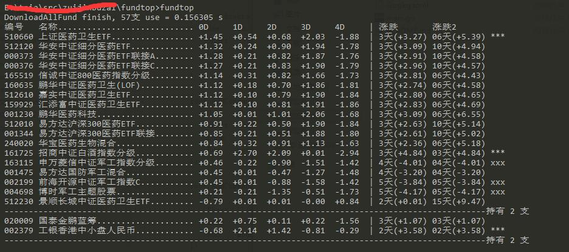

## 爬取基金数据，做一些简单分析

## 用法
1.releases目录下有exe可执行文件，直接下载。

2.在一个单独的目录下运行exe，运行后会生成
- fundtop.json(基金列表数据)不用管
- fundtop.yaml (配置文件) 程序如何执行有此文件指定
- fundtop.db (基金历史净值缓存数据)不用管

## 配置

~~~
Base:
  #下载线程数
  ThreadNum: 100
  #显示天数
  ShowDays: 8
  #展示基金类型
  ShowType: false

  #默认降序，升序加_
  #涨幅天数 Zfd Zfd2_, 涨幅 Zf,Zf_,当日涨幅，前一天 0D 1D
  Sort: 0D_
  #显示条数限制
  Limit: 15

FundConfig:
  #关注的关键词
  Watched: [铁, 天, 智能, 汽车, 军工, 医药, 白酒, 体育, 煤, 碳, 石油, 计算机]
  Black: [003942, 001483, 003603, 003604, 003975, 003974]

  #自动无限翻过小山点数
  Lhd: 0.5
  #只翻过一座大山点数
  Lhd2: 2
  #翻过几天的山
  Skip: 10

FilterResultConfig:
  #只显示带C的基金
  JustC: false

#持有基金
OwnedFund:
  #基金code，name随意写自己看的  
  001986: {name: 前海人工智能}
  002251: {name: 华夏军工}
  001630: {name: 天弘计算机C}
  001618: {name: 天弘电子C}
  000457: {name: 上投摩根}
  160212: {name: 国泰估值}
~~~

#### 比如想看今天跌幅最厉害的10只基金, 配置里设置, 包含银行, 煤炭相关
 Sort: 0D_
 Limit: 10
 Watched: [银行, 煤炭]
#### 比如想看今天涨幅最厉害的15只基金, 配置里设置
 Sort: 0D
 Limit: 15

## 输出展示

